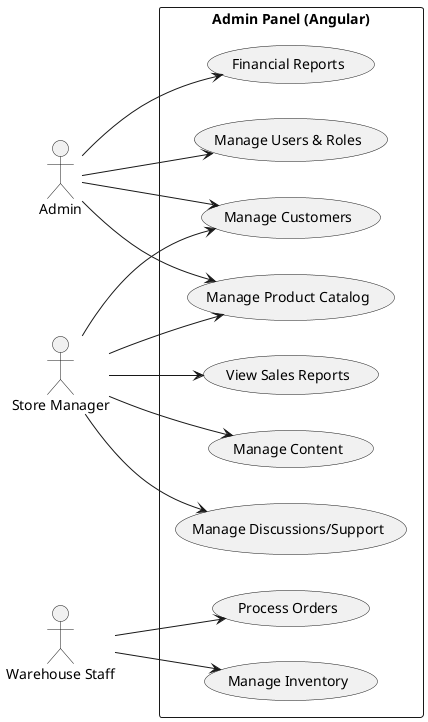

# Admin Panel Use Cases

The **Admin Panel** is a secure, internal-only application built with **Angular**. It is designed for complex operational workflows, data management, and business reporting.

## Actors

### 1. Admin
The super-user with full access to the system. Can manage configurations, users, and financial data.

### 2. Store Manager
Responsible for day-to-day operations, including sales monitoring, product catalog updates, and customer support oversight.

### 3. Warehouse Staff
Focused on logistics, inventory counts, and order fulfillment processes.

## Use Cases Description

### Manage Product Catalog
Adding new products, updating prices, modifying descriptions, and managing detailed product metadata.

### Manage Inventory
Tracking stock levels, performing stock counts, and managing warehouse locations.

### Process Orders
The fulfillment workflow: picking, packing, shipping, and handling returns or exchanges.

### View Sales Reports
Accessing analytics on revenue, top-selling products, and regional sales performance.

### Manage Customers
Viewing customer profiles, order history, and handling specialized support requests.

### Manage Discussions/Support
Handling ticket inquiries and direct customer communications.

### Manage Content
Updating banners, blog posts, and other dynamic content displayed on the Storefront or Landing sites.

### Manage Users & Roles
creating internal accounts and assigning permissions (RBAC) to ensure security.

### Financial Reports
Accessing high-level financial data, tax reports, and integration with accounting software.

## Use Case Diagram

