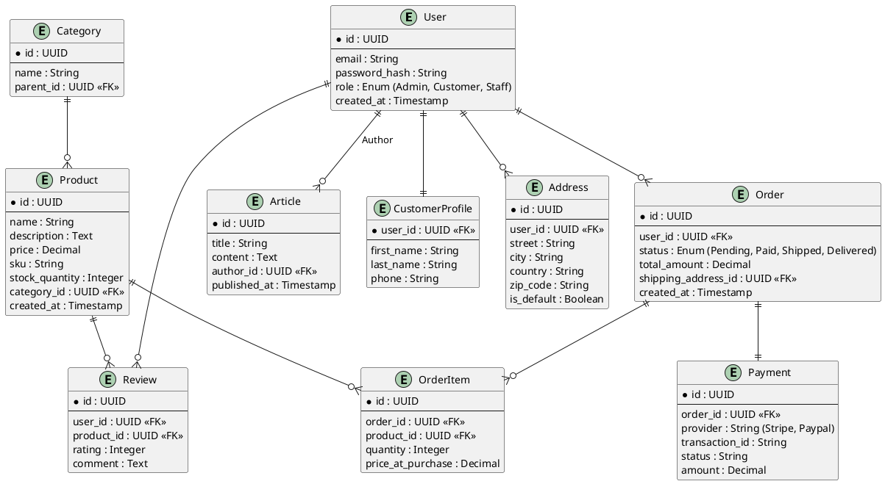

# Core Backend Entity Relationship Diagram (ERD)

This document outlines the database schema designed for the Core Backend. It supports the requirements of the Storefront, Admin, and Landing applications.

## Entities Description

### User & Authentication
* **User**: The central identity entity. Stores credentials, roles (Admin, Customer, Staff), and audit timestamps.
* **CustomerProfile**: Extended information for customers (name, phone) partially separated to support different user types.
* **Address**: Stores shipping and billing locations. Users can have multiple addresses with one being default.

### Catalog
* **Product**: The core item for sale. Contains pricing, stock, SKU, and descriptive metadata.
* **Category**: Hierarchical organization for products. Categories can have parent categories.
* **Review**: User-generated feedback and ratings linked to specific products.

### Orders & Sales
* **Order**: The header record for a transaction. Tracks status (Pending -> Delivered), totals, and user ownership.
* **OrderItem**: The specific line items within an order. Snapshots the price at purchase time to preserve history even if product prices change.
* **Payment**: Records financial transactions, provider references (Stripe ID), and status.

### Content
* **Article**: Blog posts or news items written by internal authors (Users) for the Landing page.

## Entity Relationship Diagram

