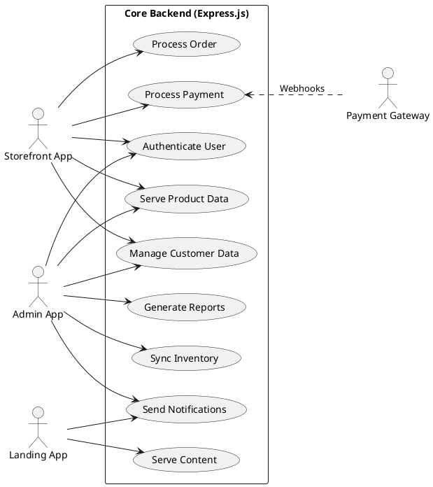

# Core Backend Use Cases

The **Core Backend** is the centralized API built with **Express.js (Node.js)**. It powers all other applications (Landing, Storefront, Admin) and manages data consistency, business logic, and third-party integrations.

## Actors

### 1. Storefront App
The Next.js application acting as a client, consuming public and authenticated APIs.

### 2. Admin App
The Angular application acting as a privileged client for management operations.

### 3. Landing App
The Vue.js application consuming content APIs.

### 4. Payment Gateway (Stripe/PayPal)
External system interacting via webhooks and direct API calls for payment processing.

## Use Cases Description

### Authenticate User
Securely handling login, registration, password recovery, and token management (JWT).

### Serve Product Data
Providing filtered, sorted, and paginated product lists and details.

### Process Order
Handling the complex logic of order creation, validation, tax calculation, and state transitions.

### Process Payment
Securely interacting with payment providers to charge cards and verify transactions.

### Sync Inventory
Ensuring stock levels are accurate across all sales channels to prevent overselling.

### Send Notifications
Dispatching transactional emails (order confirmation, shipping updates) and internal alerts.

### Manage Customer Data
CRUD operations for user profiles, addresses, and lists.

### Generate Reports
Aggregating data for dashboard queries and downloadable CSV/PDF reports.

### Serve Content
delivering dynamic content (blogs, FAQs, banners) to frontend applications.

## Use Case Diagram

