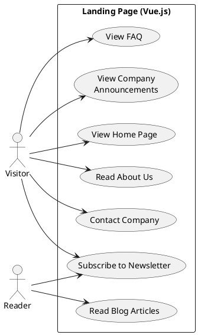

# Landing Page Use Cases

The **Landing Page** is the public marketing face of Limarpoo EIRL. It is built using **Vue.js** to ensure a lightweight, fast, and SEO-friendly experience for content delivery.

## Actors

### 1. Visitor
A general internet user who arrives at the site to learn about Limarpoo EIRL. They are potential customers or partners exploring the brand.

### 2. Reader
A visitor specifically focused on consuming content, such as blog articles, guides, or news updates.

## Use Cases Description

### View Home Page
The primary entry point. Visitors view the company introduction, key value propositions, and highlighted announcements.

### Read About Us
Visitors can read the company history, mission statement, values, and information about the team.

### Read Blog Articles
Users can browse and read articles related to the industry, guides, and updates. This is crucial for content marketing and organic reach.

### Contact Company
A form or contact information section allowing visitors to get in touch with Limarpoo EIRL for inquiries.

### View FAQ
A section dedicated to answering common questions, reducing the support burden and helping users help themselves.

### Subscribe to Newsletter
Allows users to opt-in to marketing communications, updates, and news via email.

### View Company Announcements
A dedicated section for official company news and press releases.

## Use Case Diagram

