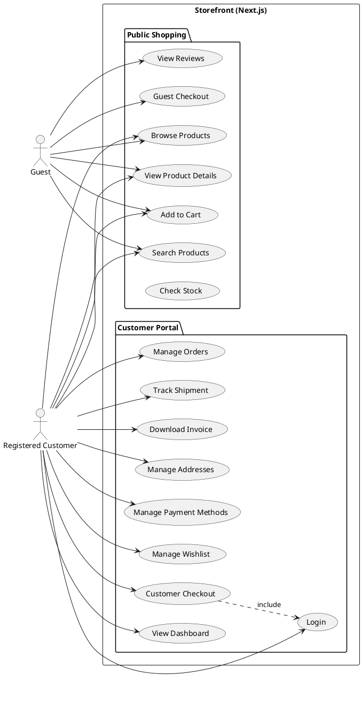

# Storefront Use Cases

The **Storefront** is a **Next.js** application serving as the primary e-commerce platform. It provides a seamless experience for both public shopping (unauthenticated) and authenticated customer management.

## Actors

### 1. Guest
An unauthenticated user browsing the store. They can search for products, view details, and even make purchases using guest checkout.

### 2. Registered Customer
A logged-in user who has access to the full suite of features including order tracking, persistent profiles, and rewards.

## Use Cases Description

### Public Shopping (No Login Required)
* **Browse Products**: Navigate through categories and product listings.
* **Search Products**: Find specific items using keywords and filters.
* **View Product Details**: See images, descriptions, specs, and stock status.
* **Add to Cart**: Manage a temporary shopping cart.
* **Guest Checkout**: Complete a purchase without creating a permanent account.
* **View Reviews**: Read feedback from other customers.
* **Check Stock**: Verify product availability in real-time.

### Customer Portal (Login Required)
* **Login**: Authenticate securely to access private data.
* **View Dashboard**: Access a summary of account activity and recommendations.
* **Manage Orders**: View order history and detailed status of current orders.
* **Track Shipment**: Real-time tracking of active deliveries.
* **Download Invoice**: Access PDFs for past purchases.
* **Manage Addresses**: Create, edit, and delete shipping/billing addresses.
* **Manage Payment Methods**: Save credit cards safely for faster checkout.
* **Manage Wishlist**: Save items for future purchase.
* **Customer Checkout**: Accelerated checkout using saved details.

## Use Case Diagram

